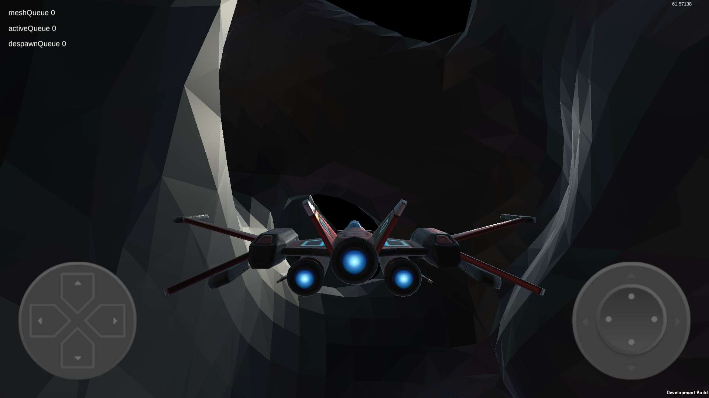

# MySkyline
This project is still in work. Currently, you can only fly in a infinite world. 

## Foundation : Procedural Generation Algorithm

In order to generate the infinite world, I used two basic algorithm :

- [Perlin Noise(Simplex Noise)](https://en.wikipedia.org/wiki/Perlin_noise) :
  Generate random factors by the coordinate of the vertex.
- [Marching Cubes](https://en.wikipedia.org/wiki/Marching_cubes) :
    Produce mesh data by these factors.

### Perlin Noise 
Because Unity only had 2D Perlin Noise, I have to implement the 3D Noise by myself. After searching in Google, I found :

- [Understanding Perlin Noise](https://adrianb.io/2014/08/09/perlinnoise.html) : This article help understanding the theory of the Perlin Noise.
- [Improved Perlin Noise](https://mrl.nyu.edu/~perlin/paper445.pdf) : Ken Perlin's Paper of Improved Noise in 2002.
- [Implementation Of The Improved Perlin Noise](https://mrl.nyu.edu/~perlin/noise/) : Implementation in JAVA.
- [Improved Perlin Noise in C#](https://gist.github.com/Flafla2/1a0b9ebef678bbce3215) :  A implementation in C# on Github Gist.

Through all of these, I implemented 3D Noise. And do some reserch about : 
- [https://gamedev.stackexchange.com/questions/166124/perlin-noise-generation-always-returning-zero](https://gamedev.stackexchange.com/questions/166124/perlin-noise-generation-always-returning-zero) : Do Not Use Integer Input.
- [Simplex Noise](https://catlikecoding.com/unity/tutorials/simplex-noise/) 
- [Noise](https://catlikecoding.com/unity/tutorials/noise/)
- [Fractal](https://code.google.com/archive/p/fractalterraingeneration/wikis/Fractional_Brownian_Motion.wiki)

### Marching Cubes
Now I have random factors, but for generating Mesh in Unity, The Marching Cubes Algorithm is more important. After searching :
- [Marching Cubes](http://kucg.korea.ac.kr/seminar/2001/src/PA-01-16.pdf) : the paper of Marching Cubes.
- [Marching-Cubes in Unity](https://github.com/Scrawk/Marching-Cubes) : a C# implementation in Unity.
- [An Implementation of the Marching Cubes Algorithm](http://www.cs.carleton.edu/cs_comps/0405/shape/marching_cubes.html) : an article easy to understand Marching Cubes.

There are many more and better algorithms, but I chose the simplest because of the time and cost of learning. For future promotion :
- [Isosurface Extraction](https://swiftcoder.wordpress.com/planets/isosurface-extraction/)
